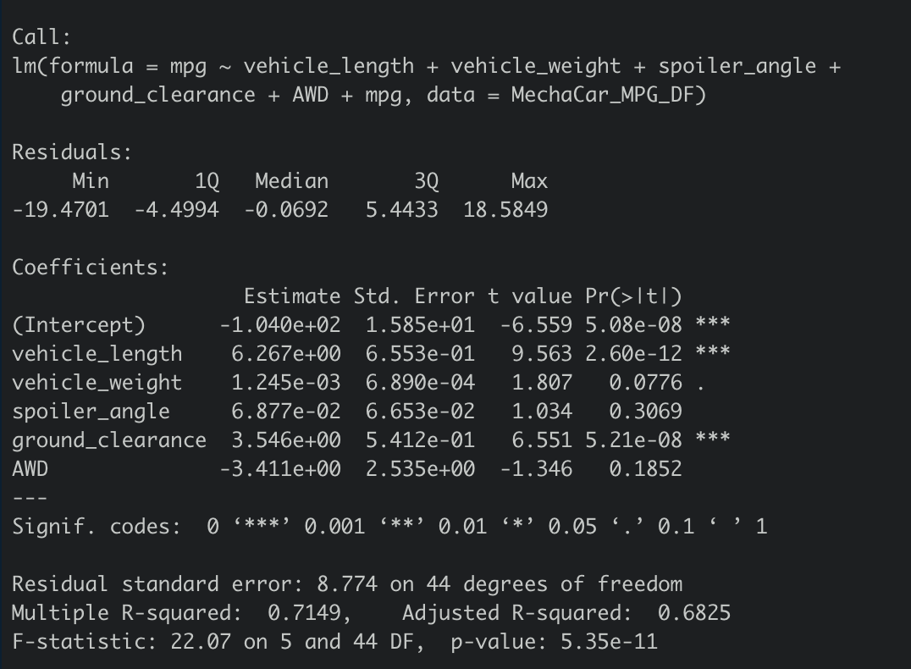

# MechaCar Analysis
## Deliverable One
#### Linear Regression to Predict MPG

##### Which variables/coefficients provided a non-random amount of variance to the mpg values in the dataset?
I would say vehicle_length and ground_clearance.
##### Is the slope of the linear model considered to be zero? Why or why not?
I say no because the the intercept and coefficient values are either negative or postve. Meaning the slope of the line would either be rising or declining.
##### Does this linear model predict mpg of MechaCar prototypes effectively? Why or why not?
I say no because there are too many variables to take account for. I do belive accounting for all variables is a great start. 
## Deliverable Two
#### Summary Statistics on Suspension Coils

##### The design specifications for the MechaCar suspension coils dictate that the variance of the suspension coils must not exceed 100 pounds per square inch. Does the current manufacturing data meet this design specification for all manufacturing lots in total and each lot individually? Why or why not?
As a whole yes the current manufacture data does meet the design specifications but individually no, Lot three has a Standard Deviation way out of range in comparison to Lots one and two.
## Deliverable Three
#### T-Tests on Suspension Coils

## Deliverable Four
#### Study Design: MechaCar VS Competition
##### What metric or metrics are you going to test?
I would take account the most significant variable and further analyze the initial results.
##### What is the null hypothesis or alternative hypothesis?
I would hypothesis that the variances would drop and I would attain cleaner more precise results. The null hypothesis would be reults get worse or nothing changes.
##### What statistical test would you use to test the hypothesis? And why?
I would choose to go with the Chi-Squared Test to perform my calculations because it fits more with what my goal is. I would want to find the differences from the first tests between tests with less variables or more signifcant variables.
##### What data is needed to run the statistical test?
Categorical data would be needed to run the tests and more than one variable to take into account for calculations.

## Summary
Math is not one of my strengths at the moment. I do understand the code portion but I am having trouble grasping the analytical and mathematical concepts. 
## Technologies Used
- RStudio
- R
- Github
- Zsh Terminal
- Google